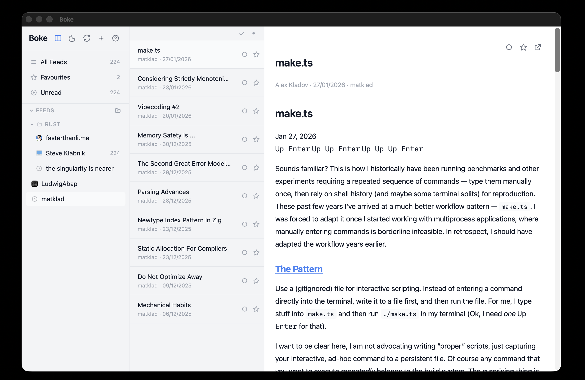

# Boke

A clean, fast, keyboard-driven desktop RSS reader.

Built with [Tauri v2](https://tauri.app), Runs natively on macOS, Windows, and Linux.

---

## What it does

Boke is an offline-first feed reader with a classic 3-panel layout: **feeds on the left, article list in the middle, reader on the right**. You paste a URL, it finds the RSS feed, and you start reading. No accounts, no cloud sync, no tracking.

### Highlights

- **Auto-discovery** -- paste any blog URL and Boke finds the RSS/Atom feed for you
- **Full article fetching** -- when a feed only provides summaries, Boke pulls the full content
- **Syntax-highlighted code blocks** -- powered by Shiki, with language detection
- **Keyboard-first** -- vim-style navigation (`j`/`k`, `o`, `gg`, `G`), plus dozens of shortcuts
- **Smart filters** -- All Feeds, Unread, and Favourites with badge counts
- **Folders** -- drag and drop feeds into folders to organize your subscriptions
- **Full-text search** -- spotlight-style search bar (`Cmd+K` or `/`) backed by SQLite FTS5
- **Dark mode** -- automatic (follows system) or manual toggle, persisted across sessions
- **System tray** -- minimize to tray, background refresh, OS notifications for new articles
- **Auto-updates** -- built-in updater checks GitHub Releases for new versions

### Supported formats

RSS 2.0, RSS 1.0 (RDF), and Atom.

---

## Keyboard shortcuts

### Navigation

| Key | Action |
|-----|--------|
| `j` / `Down` | Next article / scroll reader down |
| `k` / `Up` | Previous article / scroll reader up |
| `Enter` / `o` | Open selected article |
| `Escape` | Close reader or dialog |
| `g g` | Jump to top of list |
| `G` | Jump to bottom of list |
| `1`-`9` | Switch to nth feed |

### Reader

| Key | Action |
|-----|--------|
| `J` / `K` | Fast scroll in reader |
| `Space` | Page down |
| `Shift+Space` | Page up |

### Actions

| Key | Action |
|-----|--------|
| `m` | Toggle read / unread |
| `s` | Toggle favourite |
| `v` | Open in browser |
| `r` | Refresh current feed |
| `R` | Refresh all feeds |
| `Shift+A` | Mark all as read |
| `a` | Add feed |
| `b` | Toggle article list panel |
| `/` or `Cmd+K` | Search articles |
| `?` | Show keyboard shortcuts |
